# TIC TAC TOE GAME 
Developer: Lewis Hazelwood

💻 [Visit the live Heroku deployed site](https://ci-pp3-ttt.herokuapp.com/)

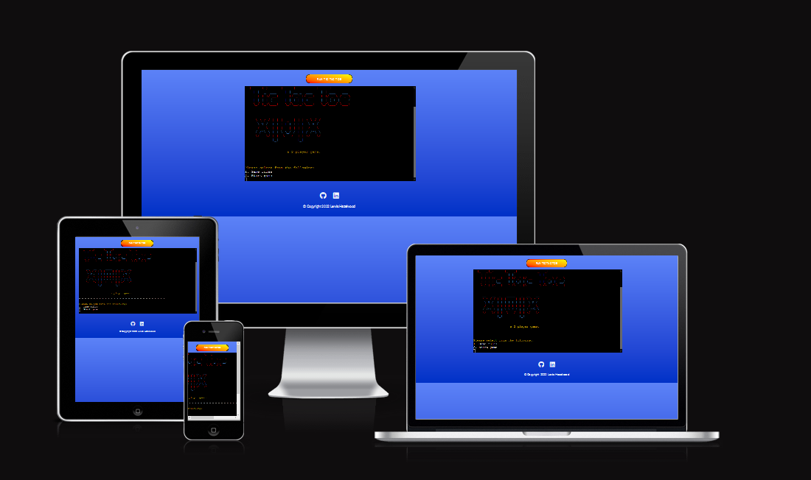

## Introduction

This is a command-line version of the game Tic Tac Toe for two players.

The classic game is played on a 3 by 3 board with 3 rows and 3 columns where the two players take turns placing either an X or O.

The objective of the game is to be the first player to get their symbol three spaces in a row, column or diagonal.

## Table of Contents
  - [Project Goals](#project-goals)
    - [User Goals](#user-goals)
    - [Site Owner Goals](#site-owner-goals)
  - [User Experience](#user-experience)
    - [Target Audience](#target-audience)
    - [User Requirements and Expectations](#user-requirements-and-expectations)
    - [User Manual](#user-manual)
  - [User Stories](#user-stories)
    - [Users](#users)
    - [Site Owner](#site-owner)
  - [Technical Design](#technical-design)
    - [Flowchart](#flowchart)
  - [Technologies Used](#technologies-used)
    - [Languages](#languages)
    - [Frameworks & Tools](#frameworks--tools)
    - [Libraries](#libraries)
  - [Features](#features)
  - [Validation](#validation)
  - [Testing](#testing)
    - [Manual Testing](#manual-testing)
  - [Bugs](#bugs)
  - [Deployment](#deployment)
  - [Credits](#credits)
  - [Acknowledgements](#acknowledgements)

## Project Goals

### User Goals

- Play a fun and easy game with other player
- Read the rules of the game
- Be able to log in to an existing account

### Site Owner Goals

- Create a game that is easy and clear to user
- Ensure that users understand the purpose of the game
- Create a game that gives feedback to the user whilst playing

## User Experience

### Target Audience

The target audience could be anyone looking to play a quick 2-player game with their friends or part of family night.

### User Requirements and Expectations

- A simple, error-free game
- Straightforward navigation
- Game personalisation by entering players' names
- Feedback on game results

### User Manual

Click here to view instructions

#### Main Menu
On the main menu, users are presented with an ASCII art rendering of the name 'Tic Tac Toe'. Below the welcome graphic there are a couple of options for user to select from.
Operation: Input a numeric value and press enter key.
1. View game rules
2. Play game

At any point of the game, if the user inputs a number which do not correspond to the available option then they will be prompt to try again.

#### Game rules
With the first option to view game rules, the users are presented with a short game rules and once read they can go back to the main menu.
Operation: Click any key and enter.

#### Play
With the Play Game option, users are asked if they have played the game before or not.
Operation: Input a numeric value and press enter key. 
The extra available option is to press 'y' key for 'yes' and 'n' for 'No'.
1. Yes
2. No

#### Log-in
When selecting option 1, users are asked to input their email addresses they used in the previous game, starting with the Player 1.

The email goes through a validation process. If the user inputs an email that has not been registered they have an option to either try another email or create a new user.
Operation: Input a numeric value and press enter key.
1. Try another email
2. Create a new player

User can try to input their email address until it matches the one already registered. If it does, then the greeting message with their name will be displayed.
If they forgot their email address they can create a new players by selecting the second option.

Same option follow for Player2.

#### New players registration (sign-up)
This option is available from the play option menu and during the existing users log-in.
Here you can sign up to create a new user.

Firstly, the Player1 is asked for their name follow by the email address. Both values go through the validation.

Username has to be between 2-12 characters long and contain only A-Z. It can already exist in the database.
Email: has to be a valid email containing exactly one @-sign from an existing domain. It must not exist in the database.

Same option follow for Player2.

If the registration is selected as part of the log-in option (Create a new player), then the relevant player will need to input their name and email address and once validated, type the email again for log in.

#### Users greeting

Once both users have been logged in, the program will display a greeting message with both names and start the game.

#### Game

Players take turns to make their moves.
The player to start is randomly selected by the program.
The current player's name is displayed showing which piece they play with. Player has to select which space they want to place their pieces.
Operation: Input a numeric value between 1 - 9 and press enter key.

A selection of invalid space or key will display a warning message and ask user to select a valid space or key.

The game continues until one of the players gets three in a row, column or diagonal.

When a player wins, a message with their name is shown on the screen.

Players have 4 different options to choose from:
1. Play again
2. Go to main menu
3. See your statistics
4. Quit game

Operation: Input a numeric value and press enter key.

#### Play again
By selecting this option a new game starts for the same players.

#### Go to main menu
Brings players to the main menu of the program.

#### See your statistics
Display number of games won so far by each logged player.

#### Quit game
With the guit game option, the user exits the program with a goodbye message.

[Back to Table Of Contents](#table-of-contents)

## User Stories

### Users

1. I want to have clear options to select in the main menu
2. I want to be able to read the rules of the game
3. I want to personalise the game and enter my name
4. I want to be able to log-in if I return to the game
5. I want to receive a real time feedback throughout the game
6. I want to get a feedback when I win the game
7. I want to be able to play multiple games when I'm logged in
8. I want a random selection of the player to start a new game
9. I want to see how many games I've won so far

### Site Owner

10. I want users to have a positive experience whilst playing the game
11. I want users to easily select options from the menu
12. I want user names and emails to be saved to Google Spreadsheet
13. I want the user to get feedback in case of wrong input
14. I want data entry to be validated, to guide the user on how to correctly format the input

[Back to Table Of Contents](#table-of-contents)

## Technical Design

### Flowchart

Flowchart

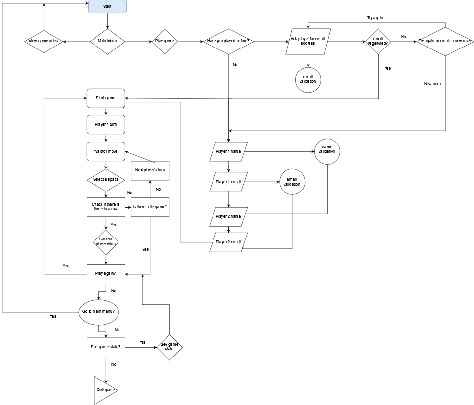

## Technologies Used

### Languages

- [Python](https://www.python.org/) programming language for the logic of the program

### Frameworks & Tools

- [Diagrams.net](https://app.diagrams.net/) was used to draw program flowchart
- [Font Awesome](https://fontawesome.com/) - icons from Font Awesome were used in the footer below the program terminal
- [Git](https://git-scm.com/) was used for version control within VSCode to push the code to GitHub
- [GitHub](https://github.com/) was used as a remote repository to store project code
- [Google Cloud Platform](https://cloud.google.com/cloud-console/) was used to manage access and permissions to the Google Services such as Google auth, sheets etc.
- [Google Sheets](https://www.google.co.uk/sheets/about/) were used to store players details
- [PEP8](http://pep8online.com/) was used to check my code against Python conventions
- [Heroku](https://dashboard.heroku.com/apps) was used to deploy the project into live environment
VSCode was used to write the project code using Code Institute template

### Libraries

#### Python Libraries
- os - used to clear terminal
- random - used to alternate first player to start the game
- sys & sleep - used to create a typing effect within the games rules
- time - used to displayed delayed messages in the terminal

#### Third Party Libraries
- [colorama](https://pypi.org/project/colorama/) - JUSTIFICATION: I used this library to add color to the terminal and enhance user experience. I marked warning/error information with color red and user feedback with blue and green
- [email_validator](https://pypi.org/project/email-validator/) - JUSTIFICATION: I used this library to validate if user email input is of the form name@example.com
- [gspread](https://docs.gspread.org/en/latest/) - JUSTIFICATION: I used gspread to add and manipulate data in my Google spreadsheet and to interact with Google APIs
- [google.oauth2.service_account](https://google-auth.readthedocs.io/en/master/) - JUSTIFICATION: module used to set up the authentification needed to access the Google API and connect my Service Account with the Credentials function. A creds.json file is created with all details the API needs to access the google account. In deployment to Render this information is stored in the config var section.

[Back to Table Of Contents](#table-of-contents)

## Features

## Main Menu
- Provides user with graphic welcome message
- Gives user option to view game rules or start game
- User stories covered: 1, 2

    
Main Menu Screenshot

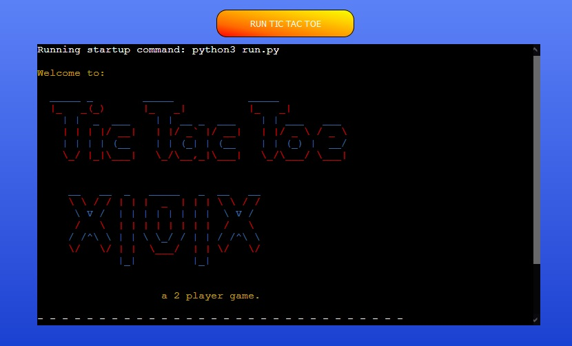

### Game rules
- Displays clear game rules
- Allows user to return to the main menu once read
- User stories covered: 2

    
Game rules Screenshot

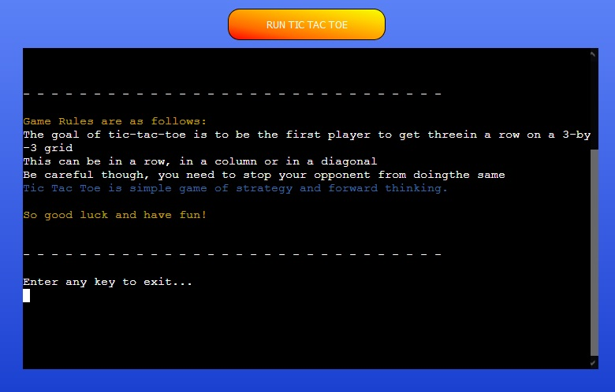

### Play options
- Gives players options to either log in or create a new user
- User stories covered: 4

    
Play options Screenshot

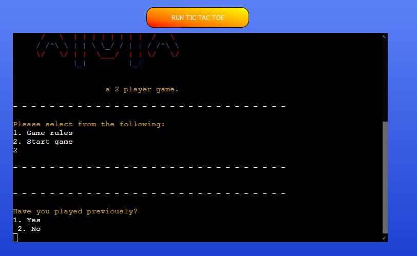

### Log-in
- Asks users for their email addresses
- Informs them if the email they input is incorrect or not registered
- Gives user alternative option to try another email or create a new player
- If correct, saves their details to Google Spreadsheet
- User stories covered: 4, 5, 12, 13, 14

    
Log-in Screenshot

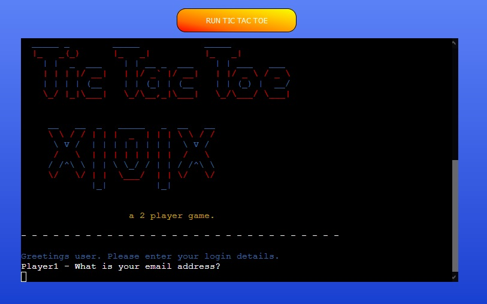

    
Alternative options Screenshot

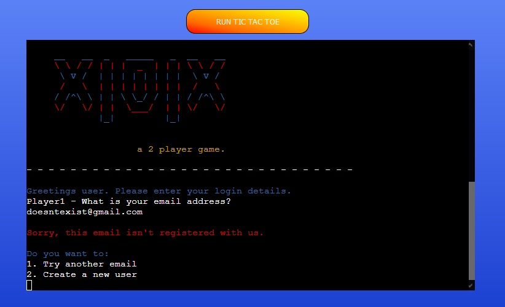

### Sign-up
- Asks user for their name and email address
- Validates user input values
- Informs user if the name they input is incorrect
- Informs user if the email is already taken and asks for another one
- User stories covered: 5, 12, 13, 14

    
Sign-up Screenshot

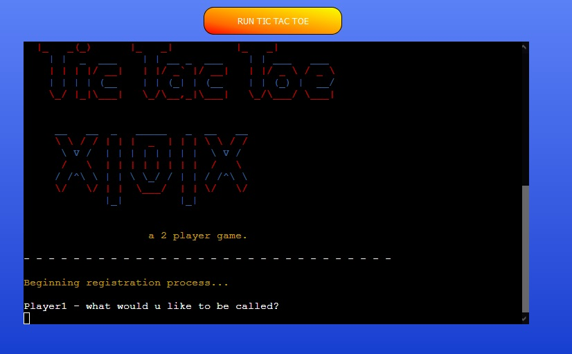

    
Sign-up name verification Screenshot

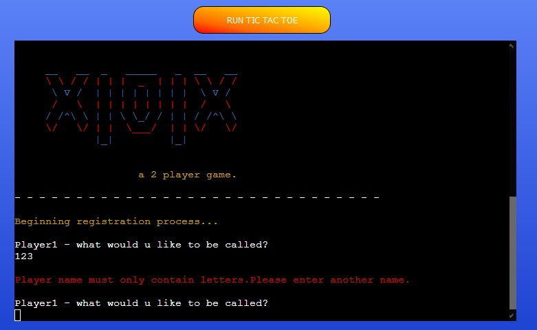

    
Sign-up email verification Screenshot

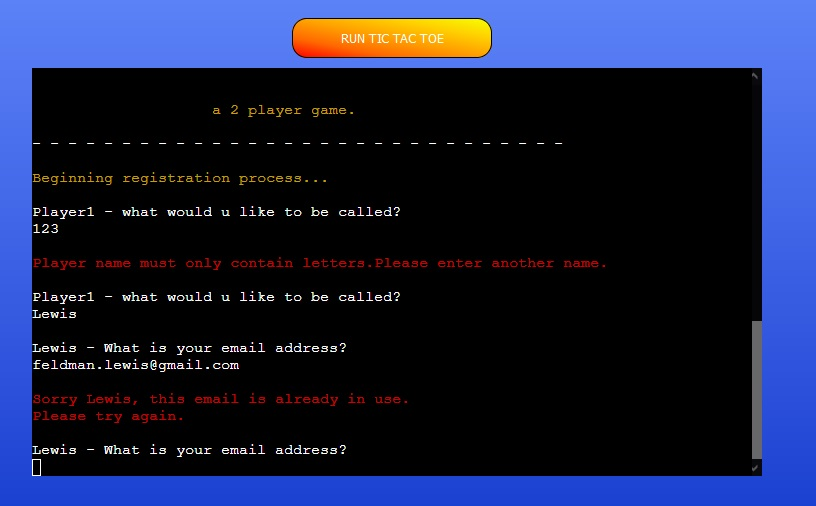

### Users greeting
- Displays a greeting message to the user once logged in
- User stories covered: 3, 10

    
Greeting Screenshot

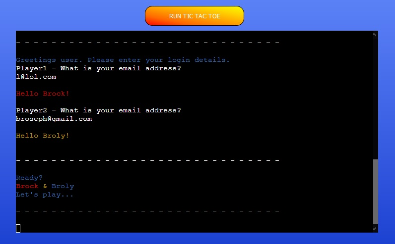

### Game
- Displays the name of currect player
- Players are asked to select a space available
- Display warning message of incorrect space selected
- Provide feedback on who's won the game
- Gives options to play again after finished game
- User stories covered: 3, 5, 6, 13, 14

    
Game Screenshot

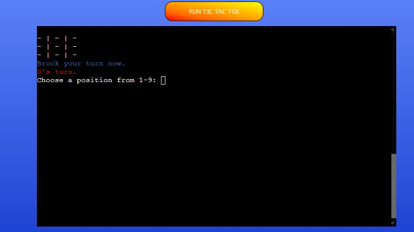

    
Incorrect Move in Game Screenshot

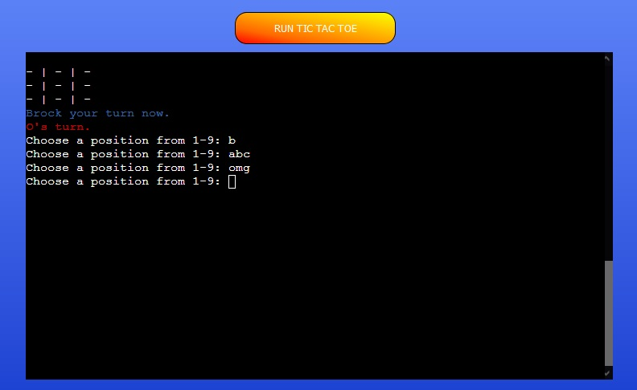

    
Winner Message Screenshot

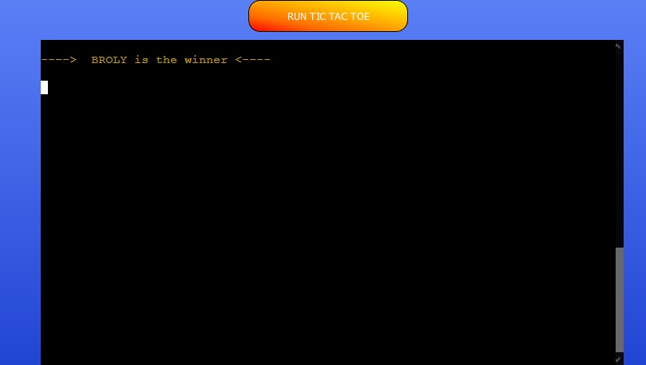

### Finished Game options

    
Finished Game options Screenshot

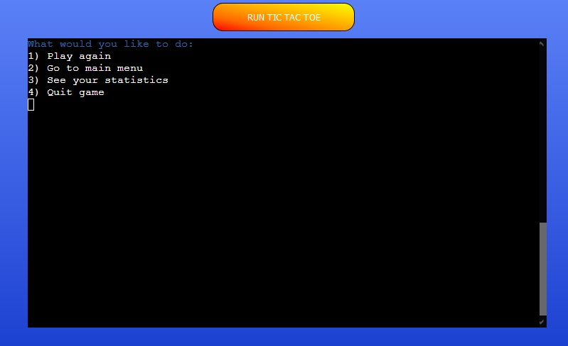

#### Play 
- Restarts the game for the same players
- User stories covered: 7

    
Restart game Screenshot

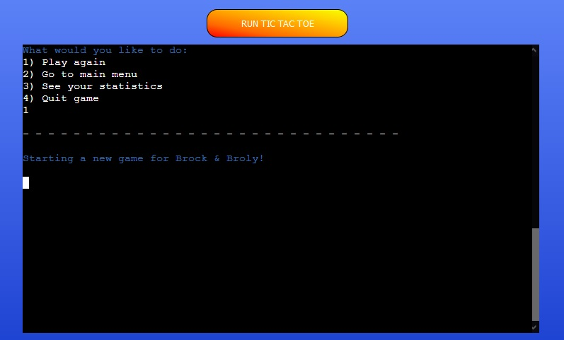

#### Go to main menu
- Brings players to the main menu of the program

#### See your statistics
- Display number of games won so far by each logged player
- User stories covered: 9

    
See your statistics Screenshot

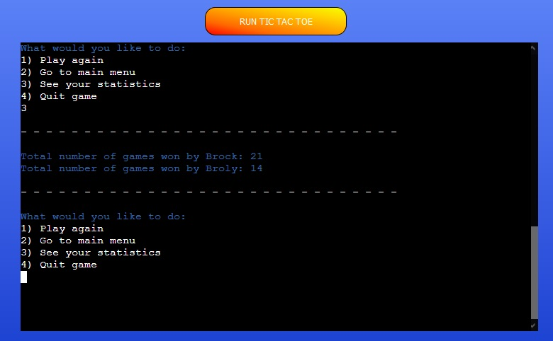

#### Quit game
- Exits the program with a goodbye message

    
Quit game Screenshot

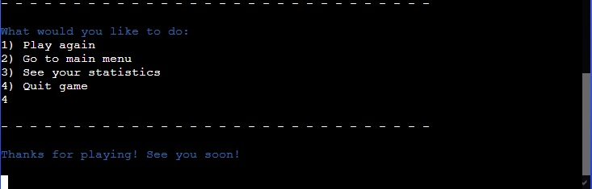

## Validation

[PEP8 Validation Service](http://pep8online.com/) was used to check the code for PEP8 requirements. All the code passes with no errors and no warnings to show.

| **Bug** | **Fix** |
| ------- | ------- |
| When selecting 'go back to main menu' option after the game has finished, the game title was not displayed | Move the function to the correct place |
| Console clear command was clearing all the content needed to display the board | Move the clear console method to correct identation
| Undefined player name was causing game to crash on email signup | Refactor code to allow the players to sign up seperately
| There were quite a few errors and warnings related to exceeded number of characters in line, whitespace within a blank line, trailing white spaces or missing white spaces around operators | Split the comments or print functions into two separate rows maintaining correct indentation. Followed a guidance within pep8 online tool and corrected all warnings and errors |

## Deployment
The website was deployed to [Heroku](https://id.heroku.com/) using the following process:
1. Login or create an account at [Heroku](https://dashboard.heroku.com/)
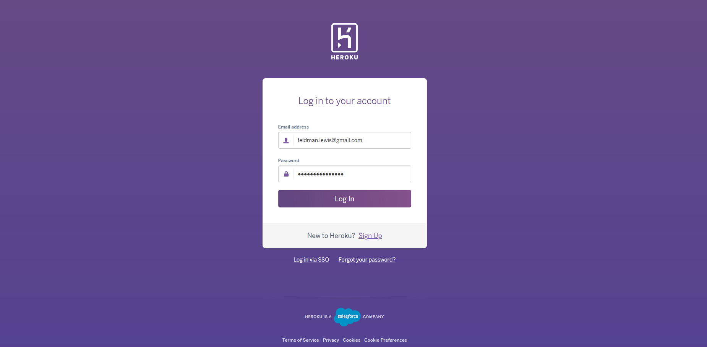
1. Click on New > Create new app in the top right of the screen.
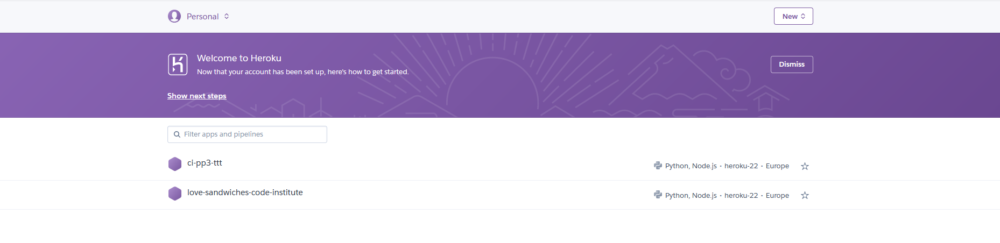
1. Add an app name and select location, then click 'create app'.
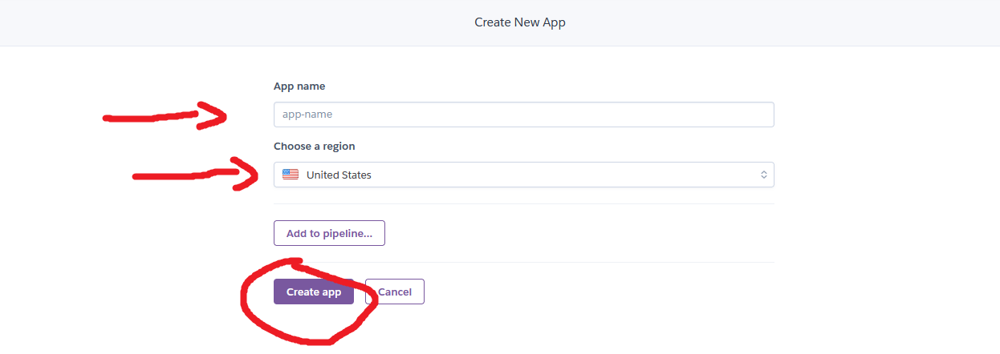
1. Under the deploy tab of the next page, select connect to GitHub.
1. Log in to your GitHub account when prompted.
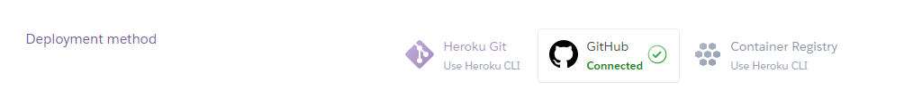
1. Select the repository that you want to be connected to the Heroku app.
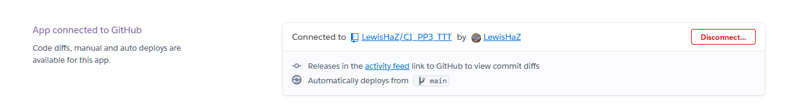
1. Click on the settings tab.
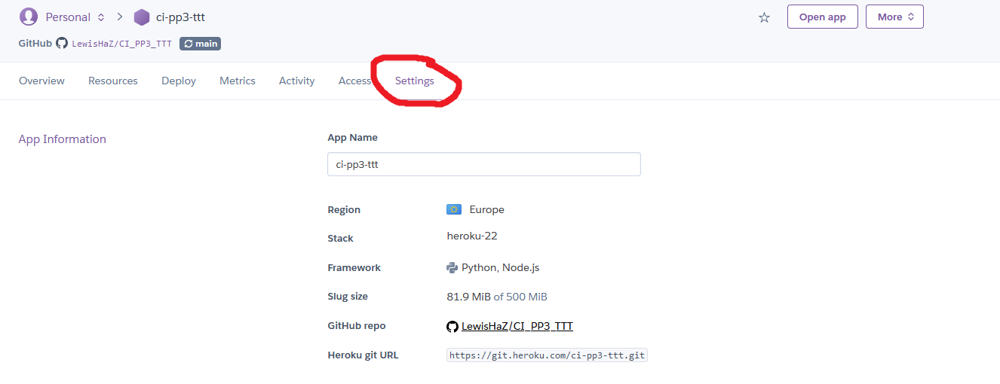
1. Scroll down to the config vars section, and add 2 config vars:
    * The first key is CREDS and the value here is the creds.json file that was generated for the google sheets API to work properly.
    * The second key is PORT and the Value is 8000
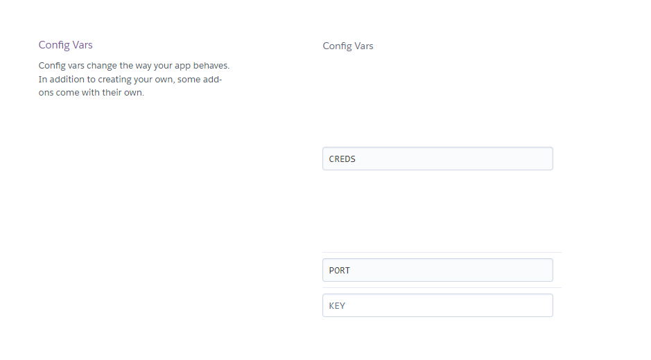
1. Once you have set up the config vars, scroll down to buildpacks (still under the settings tab)
1. Add the Python and Node.js buildpacks to your app and make sure that when they are displayed, they appear in the order:
    * Python
    * Node.JS
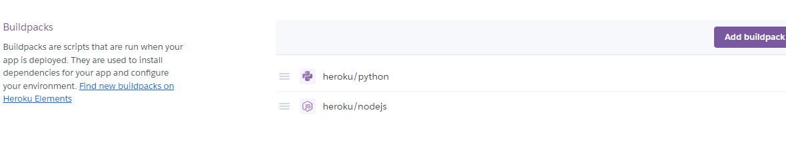
1. Navigate back to the settings tab.
1. Select automatic deploys to allow Heroku to build the site with new changes each time changes are pushed to GitHub.
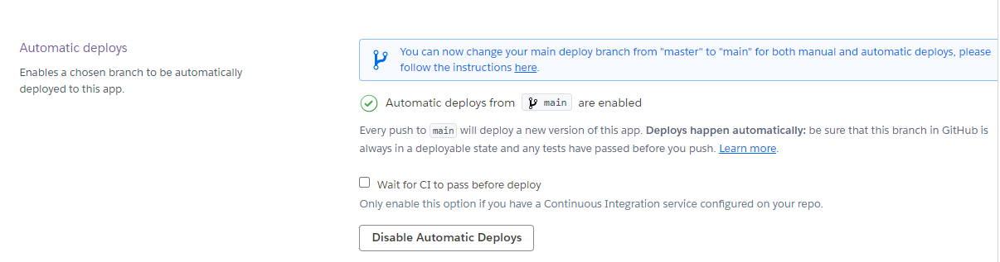
1. In the 'manual deploy' section beneath this, make sure the branch selected is 'main' and click deploy branch.
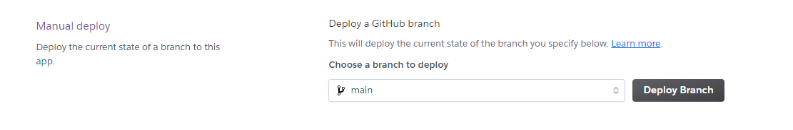
1. The site should now be built and Heroku should provide a url for the built site.

### Forking the GitHub Repository
1. Go to the GitHub repository
2. Click on Fork button in top right corner
3. You will then have a copy of the repository in your own GitHub account.
   
### Making a Local Clone
1. Go to the GitHub repository 
2. Locate the Code button above the list of files and click it
3. Highlight the "HTTPS" button to clone with HTTPS and copy the link
4. Open Git Bash
5. Change the current working directory to the one where you want the cloned directory
6. Type git clone and paste the URL from the clipboard ($ git clone https://github.com/YOUR-USERNAME/YOUR-REPOSITORY)
7. Press Enter to create your local clone

[Back to Table Of Contents](#table-of-contents)

## Credits

### Images
- [Flaticon](https://www.flaticon.com/free-icon/tictactoe_10249244) by Mayor Icon - used for the website favicon

### Code
- [ASCII Art Generator](http://patorjk.com/software/taag/) was used to create game title/logo
- Code Institute - for git template IDE and "Love Sandwiches - Essentials Project" which helped me with connecting the Google Spreadsheet to my project.
- [ColorSpace](https://mycolor.space/gradient) was used to create a gradient button and background effect
- How to install a Python module, eg. [email validation](https://pypi.org/project/email-validator/Installing)
- [gspread documentation](https://docs.gspread.org/en/latest/user-guide.html) explained how to obtain a specific value from the google spreadsheet

## Acknowledgements
Many thanks to all those around me for the support, including:
-A fellow software developer named Cameron.
-Family, friends and my wonderful fiancee.
-Mo Shami my tutor for the guidance.

